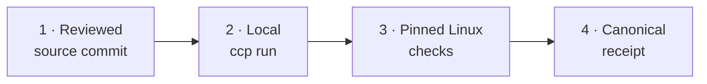
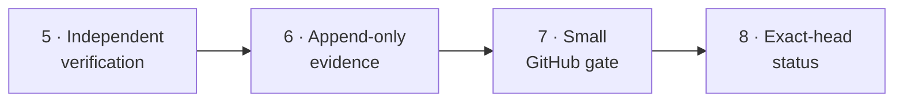

# Commit CI Preflight

Proof-carrying CI for developer-owned execution. Commit CI Preflight runs a
reviewed, pinned execution contract on your hardware, writes a commit-bound
receipt, and lets GitHub verify that evidence instead of rerunning heavy work.

Commit CI Preflight is an independent, vendor-neutral Apache-2.0 project with a
Rust core. It is designed for teams whose remote CI cost or queue time is
growing, but who do not want cost control to weaken review, security, or
platform coverage.

> Status: **v0.1.0-rc.1 prerelease**. The source implementation and native
> benchmark evidence are complete. The
> [GitHub prerelease](https://github.com/MarcoPorcellato/commit-ci-preflight/releases/tag/v0.1.0-rc.1)
> distributes an unsigned macOS arm64 archive and checksum. No crate, Homebrew
> formula, Winget/Scoop package, container image, or signed artifact is published.

## The problem

Running the same formatter, compiler, test suite, and documentation build on a
powerful developer machine and again on paid hosted runners can be expensive and
slow. Moving execution to a self-hosted runner removes one deployment model, but
does not by itself give portable, independently checkable evidence.

Commit CI Preflight splits the work:

- the heavy, reproducible checks run locally in a pinned Linux container;
- a canonical receipt binds the exact Git commit, normalized configuration,
  image digest, commands, platform, and results;
- an independent Rust verifier applies repository policy;
- a small GitHub gate verifies the receipt against the exact pull-request head;
- review, permissions, trusted secrets, deployments, and uncovered native
  platforms remain remote.

The goal is not “zero CI”. The goal is to spend remote CI only where the remote
control plane adds information or trust.

## How it works

**Local execution and receipt**



<div align="center"><strong>↓ Continues below ↓</strong></div>

**Evidence and remote verification**



The source checkout is read-only inside the container. Only declared cache and
artifact paths are writable. Commands are explicit argv vectors, not an
implicit shell. Receipts omit raw output, environment values, source contents,
absolute home paths, and personal or machine identity fields.

A receipt is integrity and policy evidence. It is not an identity attestation,
a signature, or proof that arbitrary local and hosted workflows are identical.

## Quick start

Adopting CCP in another repository? Start with the
[complete adoption guide](docs/ADOPTION_GUIDE.md). It covers what remains on
GitHub, persistent cache setup, configuration and policy authoring, OrbStack or
Docker-compatible execution, exact-commit receipts, the cross-repository gate,
safe rollout, and rollback.

### 1. Five-minute first inspection (no unpublished package install)

```console
git clone https://github.com/MarcoPorcellato/commit-ci-preflight.git
cd commit-ci-preflight
cargo build --locked
./target/debug/commit-ci-preflight plan --config examples/projects/rust/.commit-ci-preflight.toml
./target/debug/commit-ci-preflight doctor  --config examples/projects/rust/.commit-ci-preflight.toml
./target/debug/commit-ci-preflight dry-run   --config examples/projects/rust/.commit-ci-preflight.toml
```

The first build can take longer when Rust dependencies are not cached. `plan`
normalizes the contract, `doctor` performs a bounded runtime probe, and
`dry-run` renders the exact container command and mounts. None of these three
commands executes project code or emits an attestable receipt.

For a real PASS and receipt, use the [clean-room tutorial](docs/TUTORIAL.md).
It first creates a separate Git repository for the fixture; running the example
configuration against this source checkout would validate the wrong repository.

### 2. Inspect a configuration without running checks

```console
./target/debug/commit-ci-preflight plan   --config examples/projects/rust/.commit-ci-preflight.toml
./target/debug/commit-ci-preflight doctor   --config examples/projects/rust/.commit-ci-preflight.toml
./target/debug/commit-ci-preflight dry-run   --config examples/projects/rust/.commit-ci-preflight.toml
```

`doctor` performs a bounded read-only runtime probe. `dry-run` prints the
exact container argv and mounts but does not execute project code.

`run` and `benchmark` are serialized through a default-on host-wide single-slot
queue so independent local agents cannot start both heavy workloads at once.
Use `--admission-timeout-seconds` to select the bounded wait. The
`admission status --json` result distinguishes the transient `queue_lock` from
the heavy-work `slot_lock`, and reports the slot's opaque owner/run identifier,
acquisition time, heartbeat time, and lease state when available. A missing
owner record, a malformed lease, or a contradiction between the OS lock and
the lease is reported as `unknown` and is never treated as inactivity. The
status also states explicitly that absence of a process in one local shell
does not prove global inactivity across Codex activities or users. On macOS, the queue is followed by a strict `macos-v4`
host-memory admission sample, and `run` has a two-second watchdog that cancels
only on sustained compound or critical pressure. Admission requires at least 20% available memory and
3 GiB reclaimable uncompressed memory, and caps swap at the smaller of 8 GiB
and 30% of physical RAM. Compression alone is advisory both before and during
the run; at pre-start it denies only when at least 70% compression accompanies
another pressure signal. The in-run watchdog treats compression the same way:
soft cancellation needs
at least two converging signals for about 30 seconds, while critical available,
reclaimable, swap, or compound-compression conditions remain immediate stops.
`resource status --json` reports bounded metrics and
capability; Linux and Windows report `unsupported_not_enforced`. Resource and
admission evidence are not part of receipts yet.

Wrap any other long local workflow with the same protection by passing one
explicit argv after `--`:

```console
commit-ci-preflight guard exec \
  --admission-timeout-seconds 21600 \
  --timeout-seconds 21600 \
  --resource-profile ready \
  --resource-workload-family brain-linux-ci-v1 \
  --resource-executor orbstack \
  --resource-execution-mode emulated \
  --resource-target-platform linux-amd64 \
  -- make all
```

The wrapper never invokes a shell, runs the child from the caller's current
working directory, never creates a receipt, and keeps the admission slot until
the supervised process tree has stopped. Both waits
default to six hours for `guard exec` and are capped at 24 hours. On macOS it
retains at most 500 local, privacy-bounded v2 summaries with workload,
executor, cache, execution-mode, target and optional requested-limit context.
The history changes no policy decision and can be disabled
with `--no-resource-history`; see the
[resource observation history contract](docs/RESOURCE_OBSERVATION_HISTORY.md).
Official launchers must pass through `guard exec` to be covered. CCP does not
claim visibility into direct Docker or OrbStack processes that bypass it; see
the [coverage and adoption inventory](docs/ORBSTACK_TELEMETRY_COVERAGE.md).
When multiple agent activities or repositories share the Mac, follow the
[cross-activity coordination runbook](docs/COORDINATION_RUNBOOK.md). It defines
the owner/lease interpretation, reservation handoff, worktree isolation, and
safe recovery rules; a process list from one terminal is not a host-wide
ownership proof.
Inspect the bounded local records without starting work:

```console
commit-ci-preflight resource history --json
```

### 3. Run the clean-room demo

Follow the [end-to-end tutorial](docs/TUTORIAL.md). It copies a tiny public Rust
fixture into its own Git repository, runs its test through a pinned container,
writes `.ccp/receipt.json`, and verifies that receipt against a
repository policy.

For installation, checksum verification, and local candidate archives, see
[the installation guide](docs/INSTALLATION.md).

## What makes it different

| Tool or approach | Primary model | Relationship to Commit CI Preflight |
|---|---|---|
| GitHub-hosted runners | GitHub provisions a remote VM and executes the workflow | Keep for remote identity, permissions, secrets, deployments, and platforms not covered by accepted local evidence |
| GitHub self-hosted runners | A machine you manage stays connected to GitHub and accepts GitHub-dispatched jobs | Commit CI Preflight runs before push without registering a long-lived runner; GitHub receives a minimized receipt |
| `act` | Reads GitHub Actions workflows and uses Docker to run actions locally | Commit CI Preflight intentionally does not execute marketplace actions; its importer emits an inert translated/manual/unsupported report and execution uses a smaller explicit config |
| Dagger | Programmable delivery engine with pipelines in code, content-addressed caching, services, and tracing | Commit CI Preflight is not a pipeline SDK or orchestration platform; it focuses on bounded local checks, canonical evidence, and a small remote policy gate |
| Earthly | Repeatable containerized builds described by Earthfiles | Commit CI Preflight does not introduce a build language; it wraps existing commands and focuses on receipt verification. Earthly's official documentation currently states that the project is no longer actively maintained |
| Commit CI Preflight | Explicit local check plan plus commit-bound receipt and independent policy verification | Optimizes the local/remote trust split rather than trying to reproduce every CI feature |

Official project descriptions used for this comparison:

- [GitHub self-hosted runners](https://docs.github.com/en/actions/concepts/runners/self-hosted-runners)
- [GitHub-hosted runners](https://docs.github.com/en/actions/concepts/runners/overview)
- [nektos/act](https://github.com/nektos/act)
- [Dagger documentation](https://docs.dagger.io/)
- [Earthly documentation](https://docs.earthly.dev/)
- [GitHub Actions pricing](https://docs.github.com/en/billing/managing-billing-on-github/about-billing-for-github-actions)

These projects solve overlapping but different problems. Commit CI Preflight
does not claim feature superiority or full GitHub Actions parity.

## Cost example (assumptions only)

Assumption (example only): pricing and quotas vary by account and date, so treat
the formula below as a planning aid.

Remote bill estimate (assumption):

`cost_remote = Σ(job_rounded_minutes × job_runner_rate) - applicable_included_credit`

Local split estimate (assumption):

`cost_local = local_runtime_minutes × chosen_local_cost_per_minute + remote_gate_cost`

Estimated savings (assumption):

`savings = previous_remote_cost - new_local_and_remote_cost`

Positive `savings` favors the split under those assumptions; zero or negative
`savings` does not. Included quota, per-job rounding, retained remote jobs,
electricity, hardware amortization, and operator time can materially change the
result.

Use your current GitHub billing inputs and measured local runtime to replace the
assumptions before deciding.

## When to use it

Use the beta candidate when:

- expensive or slow checks are deterministic and container-friendly;
- developers have capable local hardware;
- the repository can pin its runtime image by digest;
- project checks need only declared writable cache or artifact paths;
- maintainers can review a small explicit TOML plan;
- GitHub should retain the control-plane checks that only GitHub can know.

### Ideal users

- Teams that can tolerate local compute for deterministic heavy checks.
- Repositories with stable Linux-based test/lint pipelines and clean host
  runtime.
- Maintainers who prefer explicit trust boundaries in reviews and policies.

A strong initial fit is a private repository with large Rust, Python, Node, or
documentation checks that already run consistently in Linux containers.

### Non-ideal users

- Workflow design that depends on unreviewed code from hostile contributors.
- Windows/macOS/GPU-specific execution without native project receipt evidence.
- Teams requiring organization-wide identity attestation for every green signal.

## When not to use it

Do not use the beta as the sole gate when:

- checks require trusted cloud secrets, deployments, or private infrastructure;
- unreviewed code must be treated as actively hostile;
- macOS, Windows, GPU, or hardware-specific behavior lacks native evidence;
- the workflow depends on arbitrary marketplace actions or complex GitHub
  expression semantics;
- the organization requires signed identity-bound attestations;
- repository policy cannot safely accept locally produced evidence.

In those cases, retain the relevant remote or native jobs. Cost reduction never
overrides a missing trust fact.

## A0 trust and non-claims (compact)

Current evidence guarantees are:

- A0 integrity and repository-policy assertion for receipts are published.
- A0 does not claim who ran the command, truthful remote-equivalent execution,
  or complete host trust.
- A1 and higher assurance levels are separate work items and are not inferred by
  current status.

## Core commands

```text
commit-ci-preflight plan
commit-ci-preflight doctor
commit-ci-preflight dry-run
commit-ci-preflight run
commit-ci-preflight verify
commit-ci-preflight cache path|init|inventory|cleanup
commit-ci-preflight recover status --json
commit-ci-preflight recover apply <run-id> --json
commit-ci-preflight migrate-github-actions
commit-ci-preflight benchmark
commit-ci-preflight verify-benchmark
```

Key boundaries:

- `run` requires a clean Git commit and writes a canonical receipt;
- `verify` separates integrity, policy, and identity assurance;
- cache cleanup is preview-only in 0.1.0;
- `recover status` is read-only and path-free; `recover apply` accepts one exact
  64-character run identifier and only quarantines CCP-owned journal state;
- `migrate-github-actions` parses YAML as untrusted data and does not execute
  marketplace actions, expressions, commands, or secrets;
- `guard exec` is a shell-free wrapper around one explicit program argv and
  inherits the caller environment without serializing it;
- benchmark timing is observational and never affects the pinned correctness
  digest.

## Evidence and limitations

The fixed benchmark contract produced the same correctness digest on:

- native macOS arm64, with a separate OrbStack capability probe;
- native Linux x86_64 on `ubuntu-24.04`;
- native Windows x86_64 on `windows-2025`.

Receipts, exact run metadata, hashes, and claim boundaries are in
[the PR09 evidence matrix](docs/evidence/pr09/README.md).

This proves the fixed benchmark contract, not complete runtime qualification on
every platform. The complete repository preflight is currently qualified on
macOS arm64 through OrbStack. Linux and Windows complete `run` paths remain
pending. See [the beta support matrix](docs/BETA_SUPPORT.md).

## Security and privacy

Read [the threat model](docs/THREAT_MODEL.md) before enforcing receipts.
Important non-claims:

- containers are not a complete sandbox against hostile code;
- SHA-256 integrity does not prove producer identity;
- checksums are not signatures;
- cache contents are not attestation evidence;
- a local PASS does not replace GitHub review, branch policy, or trusted
  deployment controls.

Report vulnerabilities privately as described in [SECURITY.md](SECURITY.md).

## Documentation

- [Multi-runtime receipts v2](docs/MULTI_RUNTIME_RECEIPTS.md) — one exact-head
  local receipt for independently pinned compatibility runtimes.

- [Complete adoption guide for another repository](docs/ADOPTION_GUIDE.md)
- [Cross-activity coordination runbook](docs/COORDINATION_RUNBOOK.md)
- [Coding-harness integration reference](docs/agent-integrations/HARNESS_INTEGRATION.md)
- [Proof-carrying CI product roadmap](docs/PRODUCT_ROADMAP.md)
- [Programme execution ledger](docs/PROGRAMME_EXECUTION.md)
- [Repository presentation and social preview](docs/REPOSITORY_PRESENTATION.md)
- [Troubleshooting and safe recovery](docs/TROUBLESHOOTING.md)
- [Implemented architecture](docs/ARCHITECTURE.md)
- [Installation and checksums](docs/INSTALLATION.md)
- [End-to-end tutorial](docs/TUTORIAL.md)
- [Configuration contract](docs/CONFIGURATION.md)
- [Local run contract](docs/LOCAL_RUN.md)
- [Local resource observation history](docs/RESOURCE_OBSERVATION_HISTORY.md)
- [Receipt specification](docs/RECEIPT_SPEC.md)
- [Verification policy](docs/VERIFICATION_POLICY.md)
- [GitHub gate](docs/GITHUB_GATE.md)
- [GitHub Actions compatibility subset](docs/GITHUB_ACTIONS_COMPATIBILITY.md)
- [Cache and workspace contract](docs/CACHE_AND_WORKSPACE.md)
- [Benchmark and parity evidence](docs/BENCHMARK_AND_PARITY.md)
- [Upgrade and rollback](docs/UPGRADE_AND_ROLLBACK.md)
- [Beta support policy](docs/BETA_SUPPORT.md)
- [Architecture and implementation plan](docs/IMPLEMENTATION_PLAN.md)
- [Reliability hardening roadmap](docs/RELIABILITY_HARDENING_PLAN.md)
- [T2 immutable source snapshot ADR](docs/adr/0002-immutable-git-object-snapshots.md)
- [T2 contradictions analysis](docs/TRIZ_CONTRADICTIONS.md)
- [T2 invariant evidence matrix](docs/INVARIANT_EVIDENCE_MATRIX.md)
- [Testing and fault-injection contract](docs/TESTING_AND_FAULT_INJECTION.md)

## Contributing

Issues and narrowly scoped pull requests are welcome. Read
[CONTRIBUTING.md](CONTRIBUTING.md), preserve the fail-closed claim boundaries,
and never include secrets, proprietary fixtures, or personal data.

## License and attribution

Licensed under the Apache License, Version 2.0. See [LICENSE](LICENSE) and
[NOTICE](NOTICE).

Copyright 2026 Marco Porcellato.

Apache-2.0 section 4(d) governs preservation of the attribution notice in
redistributions that include a `NOTICE` file. The license does not require
advertising endorsement and does not grant trademark rights.
