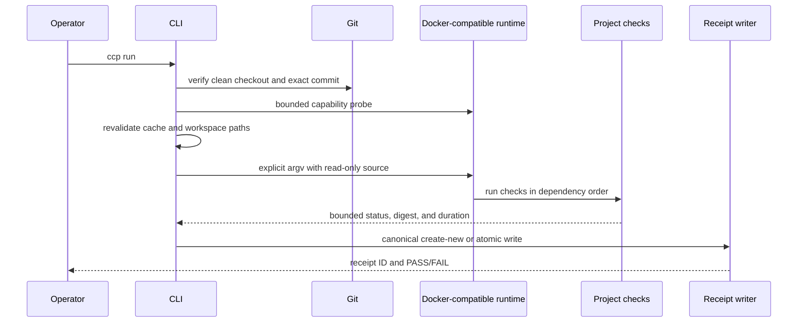

# Implemented architecture

## Status

This document describes the implemented Commit CI Preflight 0.1.0 source
candidate. Future signing, package distribution, additional runtime adapters,
and full GitHub Actions compatibility are not part of the architecture claimed
here.

T2 is implemented in source; native qualification remains pending. The
immutable source snapshot work is documented in
[`docs/adr/0002-immutable-git-object-snapshots.md`](adr/0002-immutable-git-object-snapshots.md),
[`docs/TRIZ_CONTRADICTIONS.md`](TRIZ_CONTRADICTIONS.md), and
[`docs/INVARIANT_EVIDENCE_MATRIX.md`](INVARIANT_EVIDENCE_MATRIX.md). This page
includes the implemented 0.1.0 source candidate and T2 source boundary.

The M2 workspace also provides `ccp-core` as the canonical protocol and pure
verification library and `ccp-verifier` as a bounded local source-build
binary. The latter exposes only `verify` and schema commands; it is not a
published binary or a distribution claim. `verify-benchmark` remains a root
`commit-ci-preflight` command. Static and multi-platform distribution are
deferred to M3.

## System purpose

Commit CI Preflight moves deterministic, resource-intensive checks to
developer-owned hardware while retaining a small remote control plane. The Rust
core plans explicit checks, executes them through a bounded Docker-compatible
adapter, emits a canonical commit-bound receipt, and independently verifies
that receipt against repository policy.

## Context

```mermaid
flowchart LR
    DEV["Developer or local agent"] --> CLI["Rust CLI"]
    CLI --> RUNTIME["Docker-compatible runtime"]
    RUNTIME --> CHECKS["Pinned Linux check container"]
    CHECKS --> RECEIPT["Canonical receipt"]
    RECEIPT --> VERIFY["Independent verifier"]
    VERIFY --> EVIDENCE["SHA-derived evidence branch"]
    EVIDENCE --> GITHUB["Lightweight GitHub gate"]
    GITHUB --> STATUS["Exact PR-head status"]
```

Remote review, repository permissions, protected-branch policy, trusted
secrets, deployments, and uncovered native platforms remain outside the local
receipt.

## Rust module map

| Module | Responsibility |
|---|---|
| `config` | Strict TOML schema, semantic validation, DAG normalization, and deterministic plan digest |
| `runtime` | Bounded Docker-compatible capability probe and explicit container argv rendering |
| `process` | Cross-platform timeout, cancellation, output bounds, Unix process groups, Windows Job Objects, and cleanup verification |
| `workspace` | Read-only source mount plan and declared writable cache/artifact mounts |
| `cache` | Persistent root resolution, ownership marker, content-addressed entries, inventory, locks, and preview-only cleanup |
| `admission` | Persistent platform-cache coordinator, FIFO/best-effort lock-backed tickets, one heavy-command slot, cancellation, timeout, and bounded status |
| `resource` | Strict macOS-v4 host-memory probes, pre-start policy, compound in-run watchdog, bounded extrema/trip observation, typed capability/status, and deterministic probe seams |
| `resource_history` | Privacy-minimized local JSONL summaries, strict profile validation, bounded rotation, symbolic-path rejection, and atomic persistence |
| `run` | End-to-end orchestration and fail-closed aggregation |
| `receipt` | Versioned evidence types, canonical JSON, SHA-256 integrity ID, schema, and atomic publication |
| `verify` | Independent integrity, commit, configuration, check, image, platform, and freshness policy |
| `github_actions` | Bounded YAML parsing and inert translated/manual/unsupported migration report |
| `benchmark` | Fixed cross-platform correctness workload and native receipt verification |
| `main` | CLI parsing, stable exit codes, JSON/human output, and command dispatch |

The production binary uses Rust 2024 edition. Runtime-specific details do not
enter the receipt or policy domain model beyond explicit capability evidence.

`run` and `benchmark` acquire the single host-wide admission slot immediately
before heavy execution. The coordinator lives below the platform application
cache in the dedicated `commit-ci-preflight-admission` sibling root. It never
lives inside the independently managed `commit-ci-preflight` cache root. The
coordinator uses advisory file locks whose ownership is released by the
operating system on normal exit, crash, or reboot. The slot lock remains the
authority; a separate CCP-owned lease record adds an opaque run identifier,
acquisition timestamp, heartbeat, and bounded lease state for cross-activity
inspection. A ticket can be reclaimed only when its OS lock is demonstrably
unlocked and its valid lease is definitely expired. Missing, malformed,
contradictory, or legacy lease metadata is `unknown` and remains blocking;
CCP never infers global inactivity from a PID list or one activity's shell.
`plan`, `doctor`, `dry-run`, `verify`, migration, and cache inventory remain
unqueued. Admission state is operational coordination only; the receipt schema
does not yet record queue or resource evidence.
`guard exec` uses the same host-wide admission and macOS resource guard, but it
executes exactly one explicit argv without a shell and does not write receipts.
After admission, it can attach a bounded observation accumulator to the
existing watchdog. The accumulator retains only the baseline and extrema, and
the CLI writes at most 500 strict v2 local records while still holding the
host-wide slot. Each v2 record adds a bounded non-sensitive workload family,
executor, cache state, execution mode, target platform and optional requested
CPU/memory ceilings. Persistence is advisory: failures produce a generic warning
without changing process, admission, cancellation or receipt semantics.

The run, benchmark, and guarded-terminal paths share a private terminal
finalization primitive. It completes the owned workload result, joins any
applicable watchdog, and then attempts the admission release exactly once;
release failure overrides the primary result. This primitive does not change
the cache-pin lifetime: a managed-cache pin remains held for the guarded child
lifecycle and is released when that operation returns. Nor does it change the
source-snapshot lifecycle: a run cleans its snapshot after terminal admission
finalization and before sealing the receipt.

On macOS, a fresh strict sample from the absolute system tools is required
after slot acquisition and before heavy work. `run` starts a two-second
resource watchdog before local execution; `benchmark` has pre-start admission
only in this tranche. Linux and Windows retain serialized execution but report
resource capability as `unsupported_not_enforced`; no protection is claimed on
those platforms. Resource status is read-only and bounded, and receipt schema
changes are deferred.

Policy `macos-v4` admits only with at least 20% available memory and 3 GiB
reclaimable uncompressed memory, and with swap through the smaller of 8 GiB
and 30% of physical RAM. These are independent pre-start conjuncts.
Compression is advisory by itself both before and during execution; at
pre-start, 70% or more compression denies only with another pressure signal.
Soft cancellation requires at least two converging pressure signals for 15
consecutive two-second samples; critical available memory, reclaimable memory,
or 8 GiB swap remain immediate stops. Compressor pressure becomes an immediate
stop only at 70% together with another pressure signal.

Observation history v2 is not a forecast and has no authority over admission.
It excludes repository and command identity, remains outside receipts, and is
never transmitted. The qualification and privacy contract is specified in
[RESOURCE_OBSERVATION_HISTORY.md](RESOURCE_OBSERVATION_HISTORY.md).
Coverage is cooperative: official launchers must use `guard exec`. CCP does not
intercept direct container-runtime processes, as documented in
[ORBSTACK_TELEMETRY_COVERAGE.md](ORBSTACK_TELEMETRY_COVERAGE.md).

## Configuration and planning

A version 1.0 TOML configuration declares:

- project identity;
- Docker-compatible runtime and OCI image digest;
- CPU, memory, PID, network, and timeout bounds;
- allowlisted environment variable names;
- persistent caches and repository-relative mount paths;
- explicit checks, argv, dependencies, and artifacts;
- receipt output and freshness.

Unknown fields, invalid names, path escapes, overlapping writable paths,
dependency cycles, duplicate artifacts, mutable image references, and unsafe
limits fail before execution. Normalized ordering produces a deterministic plan
digest included in policy and receipts.

## Execution sequence

Checks run without an implicit shell. Project code may explicitly invoke a
shell as its declared argv, but that choice is visible in the plan and receipt.
Required `FAIL`, `PENDING`, or `NOT_RUN` evidence prevents an overall
`PASS`.

## Workspace and cache

The source repository is mounted read-only at `/workspace`. Only declared
cache directories and artifact files receive narrowly scoped writable mounts.
Path parsing rejects traversal, control characters, non-representable Docker
mount syntax, and unsafe overlaps.

The managed cache root is never inferred as a temporary directory or repository
checkout. It has a versioned ownership marker, content-addressed entries,
completion markers, and an active-run lock. Cache bytes improve speed but are
not reproducibility or attestation evidence. Deletion is unavailable in 0.1.0;
cleanup reports only a dry-run plan.

## Process lifecycle

The supervisor uses process groups on Unix and Job Objects on Windows. It
provides:

- bounded stdout/stderr capture and output digests;
- deadline and cooperative cancellation;
- graceful termination followed by bounded escalation;
- post-cleanup existence checks;
- stale-generation rejection;
- stable result classification.

Container execution adds the runtime's init process for descendant reaping.
The architecture is containment for reviewed project checks, not a hostile-code
sandbox.

## Receipt and verification

A receipt contains minimized, typed evidence for producer version, repository
commit, run generation and timestamps, platform/runtime/image, configuration
digest, each check, and overall status. Canonical JSON and SHA-256 detect byte
or field modification.

The verifier is independent of the execution orchestrator. Its caller supplies
the expected commit and repository policy. Structural, integrity, policy, and
identity assurance are distinct; identity assurance is not implemented.

## GitHub control plane

The evidence branch name is `ccp-evidence/<exact-source-sha>`. It contains
only `.ccp/receipt.json` and is published without force-push. A receipt cannot
be committed to its own source commit without changing that commit, so the
separate SHA-derived branch preserves the binding.

The GitHub workflow:

- builds verifier code from the reviewed base revision;
- treats evidence bytes as untrusted input;
- caps input size;
- verifies the exact pull-request head;
- publishes `commit-ci-preflight/receipt`;
- uses the trusted base-branch `pull_request_target` definition but never
  executes pull-request-controlled code under it;
- uses no project test execution, Docker, cache, secret, or deployment
  credential.

## Migration assistant

The migration assistant reads one bounded GitHub Actions YAML file as untrusted
data. It recognizes a deliberately small subset and emits an inert report.
Marketplace actions, expressions, permissions, secrets, services, matrices,
reusable workflows, and unsupported syntax are never silently executed or
translated into runnable configuration.

## Supply-chain and candidate packaging

`Cargo.lock`, the Rust toolchain, and the runtime image are pinned. The
release-metadata example deterministically generates:

- an SPDX 2.3 SBOM covering the complete locked Cargo graph;
- third-party inventory, checksums, declared licenses, and deduplicated license
  or notice texts.

The local candidate builder verifies metadata parity, tests the release
contract, builds with `--locked`, packages the binary and required legal and
operator documents, and emits `SHA256SUMS`. It cannot tag, upload, sign, or
publish.

## Platform evidence

The fixed benchmark is qualified on native macOS arm64, Linux x86_64, and
Windows x86_64. The complete repository preflight is qualified on macOS arm64
through OrbStack. Benchmark evidence is not promoted into full runtime
qualification. Exact statuses are maintained in
[`BETA_SUPPORT.md`](BETA_SUPPORT.md).

## Architectural non-goals

The 0.1.0 candidate does not implement:

- arbitrary GitHub Actions execution;
- a general pipeline SDK or build language;
- a long-lived self-hosted runner;
- remote log collection or telemetry;
- hostile-code isolation;
- receipt signing or identity attestation;
- automatic cache deletion;
- package or release publication.
