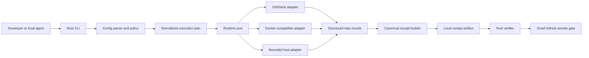

# Commit CI Preflight — autonomous implementation plan

## 1. Document control

| Field | Value |
|---|---|
| Status | Implementation complete through PR 10; `v0.1.0-rc.1` GitHub prerelease published; registry packages and signatures require separate authorization |
| Owner | Marco Porcellato |
| Initial date | 2026-08-08 |
| License | Apache-2.0 with repository `NOTICE` |
| Core language | Rust 2024 edition |
| Public identity | Independent and vendor-neutral; no unrelated product branding |
| Recommended repository | `MarcoPorcellato/commit-ci-preflight` |
| Initial release target | `0.1.0` after real multi-platform qualification |

This document is the execution contract for taking the repository from its
bootstrap commit to a truthful public beta. It is intentionally detailed so a
capable coding agent can proceed after one explicit owner authorization without
inventing product, security, licensing, or release decisions along the way.

The beta implementation described here is complete. Productization after the
beta is governed by [PRODUCT_ROADMAP.md](PRODUCT_ROADMAP.md), which adds staged
activation, verifier separation, distribution, cost intelligence, Linux
qualification, identity assurance, and evidence-backed stable-release gates.

### 1.1 Implementation progress

| Tranche | Status | Evidence |
|---|---|---|
| PR 01 — receipt contract | Merged | main `0095002b49f4fd09532c796ddc9955a6be6f8c1f` |
| PR 02 — configuration plan | Merged | main `2cfee83eea8ab16f1d37b128e980d7441f6ee94e` |
| PR 03 — runtime and supervisor | Merged | main `65f3ae5560a711aea21d9b2f9fefbfdeda0d125a`; Windows/Linux native proof pending |
| PR 04 — cache and workspace isolation | Merged | main 2661266fb0f1276eb39d382ede64fba2b0fd1f80 |
| PR 05 — end-to-end local run | Merged | main af7d760061a64b908ddb50c625c62843d467bb60 |
| PR 06 — independent verifier and policy | Merged | main 80222e16353e8e626b6e5e55e92d8d0a2c2ddede |
| PR 07 — lightweight GitHub gate | Merged | main `362625e6ced93f8e699558ac44fd69be95417c52` |
| PR 08 — GitHub Actions compatibility subset | Merged | main `104275f8a8465bad380130d8fbec5837c6a0ef10` |
| PR 09A — benchmark and parity contract | Merged | main `2305c1f46930069614b023bc6b8dcfb8a6ae27d5`; portability follow-up main `15f858403b19ade38373176879fb518ef167580d` |
| PR 09B — native qualification evidence | Merged | main `aaaef7be67200d6f4f62bac5c77b4d0989329d92`; three native receipts and exact GitHub run metadata |
| PR 10 — beta hardening and candidate | Merged | main `cd4f418d9083b6dbad3112d12374b7c53f900758`; human-first README, SPDX SBOM, third-party notices, installation/checksums, rollback, threat model, tutorial, support policy, local packaging proof, and trusted-base transition receipt |
| PR 11 — bounded host-wide admission tranche | Merged | PR #20; main `b628fbcb43c33ea1a8c7e3d5a48ddfe095f02317`; default-on single-slot queue for `run` and `benchmark` |
| PR 12 — macOS resource guard tranche | Merged | PR #21; main `752e81df1e4dba2524f2116c2ed31d17026ee80e`; macOS-v1 pre-start memory admission, `run` watchdog, bounded resource status, and explicit unsupported Linux/Windows capability |
| PR 13 — guarded external workflow tranche | Merged | PR #22; main `b9835d66414370b88273a338441f7ab9be528aad`; shell-free `guard exec`, six-hour bounded queue/runtime defaults, live output, watchdog, and verified process-tree cleanup |
| Post-beta resource observation tranche | In progress | Privacy-minimized v2 macOS `guard exec` history with cross-repository execution context; no threshold, watchdog, receipt or remote-policy change; launcher adoption and predictive admission remain separate gates |

## 2. Mission

Commit CI Preflight reduces paid remote-CI work by moving reproducible,
resource-intensive checks to developer-owned hardware while preserving quality
through machine-verifiable evidence.

It does **not** claim that a local machine is identical to a GitHub-hosted
runner. It records exactly what ran, where, against which commit and immutable
inputs, and leaves a small remote gate to verify the evidence and enforce facts
that only the remote control plane can know.

### 2.1 Primary user outcome

A developer runs one command before pushing:

```console
ccp run
```

The tool executes the repository's declared preflight in a pinned Linux
environment and emits a receipt. A lightweight remote check then verifies that
the receipt:

- conforms to a supported schema;
- is bound to the exact pull-request commit;
- covers the required check set;
- records successful outcomes without hidden omissions;
- has not expired under repository policy;
- contains no unsupported attestation claims.

### 2.2 Success metric

For opted-in repositories, at least 80% of compute-heavy checks should execute
locally while the remote gate remains small enough to complete in roughly one
minute under normal cache conditions. Quality is preserved by retaining remote
checks for identity, authorization, branch policy, trusted secrets, and any
platform that was not genuinely qualified locally.

## 3. Non-goals

The first public release will not:

- emulate every GitHub Actions feature;
- execute arbitrary marketplace actions;
- promise hostile-code isolation from the local host;
- replace branch protection, code-owner review, merge queues, or secret-backed
  deployment checks;
- claim macOS results are Windows-native evidence;
- upload repository contents, environment values, or raw logs by default;
- include code, fixtures, names, or dependencies copied from an unrelated product or repository;
- provide a hosted SaaS control plane;
- publish to crates.io, Homebrew, Winget, or an action marketplace without a
  separate release authorization.

## 4. Product principles

1. **Truth before convenience.** `NOT_RUN` is better than a fabricated pass.
2. **Evidence is scoped.** A receipt proves only the declared commands and
   inputs it records.
3. **Remote facts remain remote.** Commit identity, protected-branch policy,
   repository permissions, and secret-backed integrations remain on GitHub.
4. **Determinism first.** Stable ordering, normalized paths, canonical bytes,
   immutable image references, and explicit clocks are required.
5. **Fail closed.** Unknown schema versions, missing required checks, stale
   commits, invalid digests, and unsupported platforms fail verification.
6. **Privacy by construction.** Receipts contain metadata and digests, not
   proprietary source or secret values.
7. **Small reversible slices.** Each pull request introduces one contract or
   capability and can be reverted without database migration.
8. **No hidden daemon.** The MVP is an explicit CLI; background execution is a
   later opt-in decision.
9. **Portable core, replaceable adapters.** Rust domain logic does not depend on
   OrbStack, Docker Desktop, or GitHub-specific APIs.
10. **Cost reductions must be measured.** Benchmark receipts compare local and
    remote duration and cost assumptions without making universal claims.

## 5. Authority model for autonomous execution

An owner may authorize the entire plan once. That authorization permits the
agent to perform the following actions **inside this repository only**:

- create isolated branches and worktrees;
- edit source, tests, documentation, examples, and repository-local CI;
- add narrowly justified Apache-2.0-compatible dependencies after review;
- run local deterministic tests, container probes, and benchmarks;
- commit and push scoped branches;
- open draft pull requests and update them after review or CI feedback;
- stack later pull requests on verified earlier branches;
- merge a pull request only when its acceptance gates are green, the diff is
  within its allowlist, and no unresolved review or security finding remains;
- create issues and milestones that exactly reflect this plan;
- tag pre-release candidates only when the plan explicitly reaches that gate.

The authorization does **not** permit:

- spending money, enabling paid services, or increasing GitHub plan usage;
- creating or rotating secrets, signing keys, cloud credentials, or tokens;
- publishing packages or marketplace listings;
- transferring repository ownership or changing visibility away from public;
- granting collaborators write/admin access;
- deleting repositories, releases, branches containing unique work, or user
  data;
- weakening branch protection or security settings;
- representing Windows, Linux x86_64, or hosted-runner evidence as executed
  when it was not;
- making legal promises beyond Apache-2.0 and the `NOTICE` file;
- using unrelated product names, trademarks, private code, or proprietary corpora.

Those excluded actions require fresh, explicit owner approval.

### 5.1 Mandatory pre-mutation check

Before every Git or GitHub mutation, the agent must verify live:

- repository and remote identity;
- current branch, HEAD, and upstream;
- clean/dirty state and untracked files;
- target branch and base SHA;
- open pull requests touching the same files;
- intended exact file allowlist;
- authentication and repository visibility when relevant.

Uncertain or unrelated work is preserved. It is never reset, deleted, stashed,
or folded into a commit without specific authorization.

### 5.2 Stop conditions

Autonomous work stops and reports evidence when:

- a requirement needs a security, licensing, or trust decision absent here;
- a new dependency is copyleft, source-available, unmaintained, or materially
  expands the attack surface;
- a change would require privileged host access or unsafe container settings;
- deterministic parity cannot be established;
- Windows-native evidence or other required hardware is unavailable;
- a benchmark would expose proprietary data;
- tests fail for a reason outside the authorized slice and cannot be isolated;
- branch protection would need weakening;
- the same blocker repeats three times without a safe alternative;
- a release requires credentials, signatures, billing, or package-registry
  publication.

## 6. Target architecture



### 6.1 Rust workspace evolution

Start with one package to keep bootstrap simple. Split only when the contracts
are proven:

```text
crates/
  ccp-core/       domain types, normalized plans, status model
  ccp-receipt/    schema, canonicalization, digest, verification
  ccp-runner/     process lifecycle and runtime port
  ccp-policy/     coverage, freshness, platform and commit policy
  ccp-cli/        user interface and exit codes
  ccp-github/     GitHub-specific receipt gate adapter
```

Dependency direction is inward: adapters depend on core ports; core never
imports Docker, OrbStack, GitHub, or UI-specific code.

### 6.2 Initial dependency policy

The bootstrap remains standard-library-only. Likely future needs include
serialization, cryptographic hashes, error contexts, CLI parsing, JSON Schema,
and temporary test directories. Each dependency is introduced in the PR that
uses it, with:

- exact purpose and rejected alternatives;
- SPDX license and transitive-license check;
- maintenance and security posture;
- feature flags minimized;
- lockfile diff reviewed;
- no network activity at runtime unless explicitly requested.

No telemetry dependency is permitted in `0.1.x`.

## 7. Core contracts

### 7.1 Repository configuration

Default file: `.commit-ci-preflight.toml`.

The first schema should support:

- configuration schema version;
- project identifier that is not a secret;
- required check IDs;
- command, working directory, timeout, and dependency relationships;
- runtime kind and immutable image digest;
- CPU, memory, process, and output limits;
- cache declarations with explicit host paths or managed cache IDs;
- environment-variable names allowed to pass through, never values in receipts;
- artifacts to hash, with size and path-boundary limits;
- receipt output path and freshness policy.

Configuration interpolation is absent in MVP. Shell expansion is not implicit.
Commands use explicit argv arrays so displayed intent and executed bytes match.

### 7.2 Status model

Canonical statuses:

- `PASS`: the declared operation ran and met its acceptance condition;
- `FAIL`: it ran and failed, timed out, was cancelled, or violated policy;
- `PENDING`: evidence requires a future authorized execution;
- `NOT_RUN`: the operation was deliberately not executed in this receipt.

`SKIPPED` may be added later only if it cannot obscure required coverage.

### 7.3 Receipt v1

The canonical receipt is JSON with stable UTF-8 bytes, sorted object keys, no
insignificant whitespace, normalized line endings, and explicit schema version.
It records at least:

- receipt ID derived from canonical content;
- schema version and producer version;
- repository identity without embedded credentials;
- commit SHA and dirty-tree policy/result;
- run start/end instants from an injected clock;
- host OS and architecture;
- runtime kind and version;
- container image reference and immutable digest;
- normalized configuration digest;
- ordered check definitions and results;
- exit code, duration, timeout/cancellation status, and bounded output digest;
- artifact path, size, and content digest where authorized;
- cache policy and cache-key digests, not cache contents;
- overall status and explicit incomplete-reason fields;
- redaction-policy version;
- optional signature envelope reserved for a later ADR.

Canonicalization receives golden-vector tests in Rust and a language-neutral
fixture directory. A digest alone does not prove an event occurred; the UI and
documentation must use “receipt” or “evidence,” not “trusted attestation,” until
a signing and identity model is approved.

### 7.4 Exit codes

Reserve stable meanings:

| Code | Meaning |
|---:|---|
| 0 | Requested operation completed successfully |
| 1 | Checks completed with one or more failures |
| 2 | CLI/configuration usage error |
| 3 | Receipt verification or policy failure |
| 4 | Runtime unavailable or unsupported |
| 5 | Cancelled, stale generation, or deadline exceeded |
| 70 | Internal invariant failure |

Exact mapping is frozen before `0.1.0` and covered by integration tests.

## 8. Runtime and process safety

### 8.1 Runtime detection

Adapters use capability probes, not product-name assumptions. Detection order
is configurable. OrbStack can satisfy a Docker-compatible port but remains
identified in receipts when the runtime exposes that fact.

### 8.2 Execution lifecycle

Every run has a generation ID. Process completion is accepted only if project,
commit, configuration digest, and generation still match. Cancellation is
cooperative first and forceful after a bounded grace period. Descendant process
cleanup is platform-specific and tested.

### 8.3 Container constraints

Defaults:

- repository mounted read-only unless a declared writable workspace is needed;
- dedicated writable output and cache mounts;
- no privileged mode;
- no host PID namespace;
- no Docker socket mounted inside the job container;
- network disabled unless a check explicitly opts in;
- CPU, memory, process, and wall-clock limits;
- deterministic locale, timezone, and reduced environmental inheritance;
- image referenced by digest for receipts that claim reproducibility.

Container isolation is documented as a boundary reduction, not a complete
sandbox against malicious code.

## 9. Persistent cache contract

Managed cache root precedence:

1. explicit CLI option;
2. `CCP_CACHE_DIR`;
3. platform application-cache directory;
4. fail with guidance if no safe persistent directory can be resolved.

The default must never be `/tmp`, `/private/tmp`, a repository checkout, or an
unresolved home-directory variable.

Required commands:

```console
ccp cache path
ccp cache init
ccp cache inventory
ccp cache cleanup --dry-run
```

PR 04 deliberately exposes preview-only cleanup. Actual deletion remains
unavailable until a later tranche can add a truthful age/retention policy.
Future deletion requires a resolved cache root, ownership marker, dry-run
preview, path containment check, and explicit operator command. The tool never
recursively deletes a broad or unresolved path.

## 10. Privacy and security model

### 10.1 Receipt minimization

Receipts exclude by default:

- environment values;
- command stdout/stderr bodies;
- repository file contents;
- absolute user-home paths;
- usernames, email addresses, machine names, IP addresses, and container IDs;
- dependency-registry credentials and remote URLs containing credentials.

Paths are repository-relative or mapped to stable logical labels. Logs remain
local unless the operator deliberately attaches them.

### 10.2 Verification levels

- **Structural:** schema and canonical bytes are valid.
- **Integrity:** digests and internal references match.
- **Policy:** required coverage, commit, freshness, image, and platform rules
  pass.
- **Identity-bound:** future signing verifies an approved identity. Not part of
  the initial MVP.

The CLI reports these separately. Structural success never implies identity.

### 10.3 Supply chain

- Commit `Cargo.lock` for the application.
- Pin toolchain and container digests.
- Generate an SBOM for release candidates.
- Review dependency licenses and advisories.
- Keep release signing outside GitHub until its custody model is approved.
- Never execute downloaded code merely to inspect it.

## 11. Delivery phases and pull-request stack

Each PR begins from the latest verified predecessor. Stacking is allowed to
avoid idle time, but a descendant is rebased after its parent merges. Every PR
contains exact scope, non-goals, test evidence, residual risks, and rollback.

### PR 00 — Bootstrap and governance

Deliverables:

- public repository and independent identity;
- Rust binary skeleton and pinned toolchain;
- Apache-2.0 `LICENSE`, `NOTICE`, contribution and security policies;
- this plan and ADR 0001;
- baseline formatting, Clippy, unit test, and documentation checks.

Acceptance:

- `cargo fmt --check`, Clippy with warnings denied, and tests pass;
- license files are exact and packaging includes them;
- repository contains no unrelated product source, brand assets, secrets, or generated
  caches;
- default branch is `main`.

Rollback: archive the empty repository or revert the bootstrap commit; do not
delete without owner approval.

### PR 01 — Receipt schema and golden vectors

Deliverables:

- versioned Rust receipt types;
- canonical JSON implementation;
- SHA-256 digest contract;
- JSON Schema and deterministic golden fixtures;
- redaction and normalized-path rules.

Required tests:

- key-order and whitespace independence before canonicalization;
- byte-identical replay;
- Unicode and line-ending behavior;
- unknown field/version rejection policy;
- secret-like values and absolute paths excluded;
- malformed status/platform/timestamp cases;
- no wall clock or randomness in fixtures.

Stop if canonicalization or cryptographic choices require an unapproved trust
claim.

### PR 02 — Configuration and execution plan

Deliverables:

- `.commit-ci-preflight.toml` parser and schema version;
- explicit argv commands and dependency DAG;
- normalized plan digest;
- bounded limits and actionable diagnostics;
- `ccp plan` read-only command.

Required tests include cycles, duplicate IDs, path traversal, empty commands,
unknown keys, environment allowlists, deterministic ordering, and oversized
plans.

### PR 03 — Process supervisor and runtime port

Deliverables:

- Rust runtime trait and structured process result;
- Docker-compatible adapter with OrbStack qualification;
- runtime capability probe;
- timeout, cancellation, descendant cleanup, and stale-generation guard;
- `ccp doctor` and dry-run execution.

No receipt can be `PASS` if cleanup, timeout, or result collection is uncertain.

### PR 04 — Persistent cache and workspace isolation

Deliverables:

- platform-safe persistent cache resolution;
- content-addressed keys;
- cache inventory and dry-run cleanup;
- repository/read-only and output mount policy;
- documented disk budget and operator cleanup.

Required tests include symlinks, unresolved variables, path escape, ownership
markers, interrupted writes, concurrent readers, and reboot persistence.

### PR 05 — End-to-end local run and receipt

Deliverables:

- `ccp run` orchestration;
- deterministic result aggregation;
- atomic receipt write;
- clear terminal summary and stable exit codes;
- sample repositories for Rust, Python, and Node checks without proprietary
  code.

Acceptance requires failure injection for command failure, timeout, runtime
loss, disk-full simulation where practical, cancellation, and stale commit.

### PR 06 — Independent verifier and policy

Deliverables:

- `ccp verify` separated from execution code paths;
- repository policy for required checks, commit, platform, image, and freshness;
- machine-readable verification report;
- fail-closed unsupported schema behavior.

Tests must prove that editing any covered receipt field invalidates integrity or
policy as appropriate.

### PR 07 — Lightweight GitHub gate

Deliverables:

- minimal GitHub workflow that builds or downloads the Rust verifier;
- exact pull-request SHA binding;
- receipt retrieval with least privilege;
- concise check summary and annotations;
- no execution of heavy project test suites remotely.

Retained remote responsibilities:

- event identity and pull-request SHA;
- repository and branch policy;
- required-review and permission context;
- secret-backed or deployment checks;
- verification on platforms not covered by accepted local receipts.

Forked pull requests and untrusted artifacts receive a separate threat-model
test. Artifact-download and cache poisoning are fail-closed.

### PR 08 — GitHub Actions compatibility subset

Deliverables:

- an explicit supported-subset importer or migration assistant;
- report of translated, unsupported, and manually reviewed workflow features;
- no arbitrary marketplace-action execution;
- public compatibility fixtures.

Initial supported candidates are checkout, setup metadata, environment names,
service declarations, matrices, and plain `run` steps. Expression semantics,
secrets, permissions, reusable workflows, and marketplace actions remain
unsupported until independently specified and tested.

Contract v1 translates pinned checkout metadata, portable environment names,
and literal POSIX `run` steps into inert proposals. Setup metadata, Linux runner
labels, services, matrices, job dependencies, and containers are surfaced for
manual review. The assistant emits no executable configuration because image,
resource, cache, artifact, and trust decisions remain operator-owned.

### PR 09 — Benchmark and parity evidence

Deliverables:

- deterministic benchmark harness;
- Mac Apple Silicon plus OrbStack receipt;
- Linux x86_64 receipt from genuine Linux execution;
- Windows-native command and receipt contract;
- GitHub-hosted comparison using a public repository where billing conditions
  permit;
- cost model with assumptions, not promises.

No platform receives `PASS` without native execution evidence.

### PR 10 — Beta hardening and `0.1.0` candidate

Deliverables:

- installation documentation and checksums;
- SBOM and third-party license inventory;
- upgrade and rollback guide;
- threat-model review closure;
- demo repository and end-to-end tutorial;
- beta limitations and support policy;
- release candidate tag prepared but not publicly published without the release
  authorization described in section 5.

### PR 11 — Bounded host-wide admission tranche

This tranche serializes heavy `run` and `benchmark` invocations from
independent repositories, agents, and cache roots through a persistent
platform-application-cache coordinator. It adds lock-backed FIFO/best-effort
tickets, cancellation, an operator-selected bounded timeout, stale-ticket
recovery after released advisory locks, and read-only status reporting.

It deliberately does not sample host memory or CPU or change receipt schemas.

### PR 12 — macOS resource guard tranche

This tranche adds default-on macOS-v1 host-memory admission after the host-wide
slot and before heavy work. It uses strict shell-free probes of the absolute
system tools, bounded capture and timeouts, conservative thresholds, and a
two-second `run` watchdog with typed resource-pressure cancellation. Probe
uncertainty fails closed. Linux and Windows remain operational and serialized,
but report `unsupported_not_enforced` rather than claiming protection.

`benchmark` receives the pre-start sample but not a mid-workload watchdog.
Receipt schemas and admission/resource evidence remain unchanged; evidence
integration is a later tranche.

### PR 13 — Guarded external workflow tranche

This tranche applies the same host-wide slot, macOS pre-start gate, watchdog,
typed cancellation, and verified process-tree cleanup to one operator-supplied
argv. It adds no shell, dependency, receipt, network action, or repository
mutation. Stdout and stderr remain separate and live while capture stays
bounded. The independent admission and child-runtime waits default to six hours
and are capped at 24 hours so multiple long workflows can queue safely.

## 12. Test strategy

### 12.1 Test pyramid

- Pure unit tests for canonicalization, policy, plans, paths, and state machines.
- Property tests for canonical receipt stability and path containment.
- Integration tests with fake runtime adapters.
- Docker-compatible contract tests with bounded images.
- End-to-end sample repositories.
- Native platform receipts for qualification.

### 12.2 Mandatory local quality gate

```console
cargo fmt --all -- --check
cargo clippy --workspace --all-targets --all-features -- -D warnings
cargo test --workspace --all-targets --all-features
cargo doc --workspace --no-deps
```

As the repository grows, add dependency-license, advisory, schema, fixture,
secret-scan, and packaging checks. Tests must use injected clocks, fixed IDs,
stable paths, pinned images, and bounded resources.

### 12.3 Platform matrix

| Platform | MVP role | Evidence rule |
|---|---|---|
| macOS arm64 + OrbStack | Primary development and local Linux execution | Native Mac host plus container-runtime receipt |
| Linux x86_64 | Remote parity reference | Genuine native or trusted Linux runner receipt |
| Linux arm64 | Architecture portability | Native/container evidence labelled arm64 |
| Windows 11 x86_64 | CLI/cache/process qualification | Genuine Windows-native execution only |
| GitHub-hosted runner | Small verifier/control plane | Separate remote receipt/check evidence |

Rosetta or QEMU results are useful compatibility evidence but never relabelled
as native architecture results.

## 13. Repository and GitHub policy

Recommended initial settings:

- public repository owned by `MarcoPorcellato`;
- default branch `main`;
- issues and private vulnerability reporting enabled;
- merge commits disabled; squash merge preferred;
- branch deletion after merge enabled only for merged topic branches;
- required pull request for `main` after bootstrap;
- required lightweight policy checks, not the heavy project workload;
- Dependabot alerts enabled, automated dependency PRs conservative;
- no Actions workflow with broad write permissions;
- no secrets in fork-triggered workflows.

The bootstrap commit may land directly because branch protection cannot govern
an empty repository. Subsequent implementation uses pull requests.

## 14. Documentation set

Before `0.1.0`, maintain:

- `README.md`: user value and quick start;
- `docs/ARCHITECTURE.md`: implemented components only;
- `docs/IMPLEMENTATION_PLAN.md`: future programme and gates;
- `docs/RECEIPT_SPEC.md`: normative receipt contract;
- `docs/THREAT_MODEL.md`: assets, actors, boundaries, and mitigations;
- `docs/CACHE_AND_WORKSPACE.md`: persistent locations, ownership, mounts, and preview-only cleanup;
- `docs/GITHUB_GATE.md`: remote/local responsibility split and exact receipt gate;
- `docs/BENCHMARK_AND_PARITY.md`: reproducible methodology, cost assumptions, and native receipts;
- `docs/RELIABILITY_HARDENING_PLAN.md`: current reliability gap register and ordered T0-T11 hardening roadmap;
- `docs/TESTING_AND_FAULT_INJECTION.md`: deterministic durable-state,
  recovery, native, and chaos evidence boundaries;
- `docs/TESTING_AND_FAULT_INJECTION.md`: deterministic, integration, native, and chaos evidence classes;
- `docs/adr/`: irreversible and cross-cutting decisions;
- `CHANGELOG.md`: user-visible evolution.

Documentation must distinguish implemented behavior, verified evidence,
planned behavior, and unavailable platform evidence.

## 15. Risk register

| Risk | Mitigation | Stop threshold |
|---|---|---|
| Local receipt forged or replayed | Commit binding, freshness policy, future identity ADR | Do not claim attestation before identity design |
| Container escape or host damage | Non-privileged defaults, bounded mounts, explicit warning | Stop on need for privileged/socket mounting |
| Receipt leaks secrets or paths | Data minimization, redaction tests, bounded outputs | Any verified leak blocks merge/release |
| GitHub compatibility overclaim | Supported subset and truthful unsupported report | No “parity” claim without fixture evidence |
| Cache deletion damages data | Ownership marker, containment, dry-run, explicit target | Stop if root cannot be proven |
| Runtime-specific lock-in | Capability port and contract tests | Adapter semantics cannot enter core |
| Supply-chain compromise | Pins, lockfile, license/advisory review, SBOM | Critical unresolved advisory blocks release |
| CI savings reduce confidence | Preserve remote control-plane checks and native gaps | Cost goal never overrides quality gate |
| Cross-platform process drift | Native receipts and adapter tests | Missing native evidence remains pending |
| Project confused with an unrelated product | Independent name, assets, fixtures, and docs | Remove any accidental product branding |

## 16. Definition of Done for `0.1.0`

The plan is complete only when all conditions below are evidenced:

- Rust core implements plan, run, receipt, cache, doctor, and verify commands;
- receipt v1 schema and canonical golden vectors are published;
- all required quality and security gates are green;
- no unresolved high/critical dependency advisory exists;
- Mac arm64/OrbStack, Linux x86_64, and Windows-native receipts are genuine and
  schema-valid, or the release scope explicitly excludes a platform without
  suggesting support;
- the lightweight GitHub gate verifies exact PR commit evidence;
- benchmark methodology is repeatable and reports limitations;
- cache survives reboot and has documented safe cleanup;
- no proprietary source, fixture, secret, or unrelated product branding is present;
- Apache-2.0 `LICENSE`, `NOTICE`, SBOM, and third-party notices ship in release
  artifacts;
- rollback and uninstall instructions are tested;
- the owner separately authorizes public package/release publication.

## 17. Autonomous execution receipt

At the end of every PR, record:

- exact base and head SHA;
- changed-file allowlist;
- decisions and assumptions;
- commands executed and exit results;
- tests not run and why;
- dependency and license changes;
- security/privacy impact;
- benchmark environment where relevant;
- residual risks;
- rollback command or revert scope;
- next PR and whether it is safe to stack.

The final programme report aggregates these receipts, compares delivered scope
against every section of this plan, and leaves no `PENDING` item disguised as
complete.
