# Threat model and review closure

## 1. Scope and claim

This threat model covers Commit CI Preflight 0.1.0: local configuration
planning, Docker-compatible execution, managed cache and workspace mounts,
canonical receipts, independent policy verification, the inert GitHub Actions
migration assistant, and the lightweight GitHub receipt gate.

The model does not treat a container as a complete sandbox for hostile code and
does not treat receipt integrity as producer identity. Signing, key custody,
hosted attestation, deployment, and secret-backed integration remain outside
the beta boundary.

## 2. Security objectives

1. Project checks cannot obtain undeclared writable host paths through the
   generated runtime invocation.
2. Receipts bind the declared commit, configuration, image, platform, commands,
   outcomes, and bounded timing without embedding raw source or secrets.
3. Verification fails closed on malformed, unsupported, stale, incomplete,
   digest-invalid, or policy-mismatched evidence.
4. GitHub verifies the exact pull-request head while avoiding repetition of the
   heavy project workload.
5. Cache initialization, inventory, and cleanup planning cannot escape a
   versioned operator-owned root.
6. Unsupported GitHub Actions features remain inert and visible for human
   review.
7. Platform and identity claims never exceed executed evidence.

## 3. Assets

- source code and repository history;
- developer host, files, credentials, Docker-compatible runtime, and network;
- configuration and repository policy;
- persistent dependency cache and completion markers;
- receipt bytes and evidence branches;
- trusted base-branch verifier and GitHub workflow;
- pull-request head identity, reviews, permissions, and protected-branch state;
- release binary, checksum, SBOM, notices, and rollback artifact.

## 4. Actors

- a trusted operator running reviewed project checks;
- an honest contributor who may make mistakes;
- an untrusted fork contributor controlling source, configuration, and receipt
  proposals;
- malicious project code executed inside a check container;
- an attacker able to alter an evidence branch or artifact;
- a compromised dependency, image, local runtime, or base branch;
- a network attacker constrained by Git, registry, and digest verification.

## 5. Trust boundaries

```mermaid
flowchart LR
    O["Operator"] --> C["Reviewed config and policy"]
    C --> R["Rust planner and runner"]
    R --> D["Docker-compatible runtime"]
    D --> P["Project checks in pinned image"]
    P --> E["Canonical local receipt"]
    E --> V["Independent Rust verifier"]
    V --> B["Append-only evidence branch"]
    B --> G["Lightweight GitHub gate"]
    G --> H["Exact pull-request head status"]
```

Boundary rules:

- project configuration is untrusted input until strict parsing and semantic
  validation pass;
- project checks are trusted build/test code, not arbitrary hostile workloads;
- the source checkout is read-only inside the container;
- only declared cache and artifact mounts are writable;
- the evidence branch is untrusted data;
- verifier code and policy come from the reviewed base branch;
- GitHub event identity and permissions remain remote facts.

## 6. Threat register

| ID | Threat | Implemented control | Residual risk / disposition |
|---|---|---|---|
| T01 | Path traversal or writable host escape | Canonical repository-relative paths, overlap rejection, explicit mount renderer, read-only source, narrow writable mounts | Runtime vulnerabilities remain outside the Rust path validator |
| T02 | Docker socket or privileged execution | No socket mount, privileged mode, host network, implicit shell, or undeclared bind | A compromised host runtime retains host-level authority |
| T03 | Command injection | Checks are explicit argv vectors; no implicit shell | Operators may deliberately invoke a shell as an explicit command |
| T04 | Secret leakage in receipts | Environment values, raw output, source, home paths, identity fields, hostnames, IPs, and container IDs are excluded | Custom artifacts and manually shared logs still require review |
| T05 | Unbounded output or process denial of service | Output caps, timeout, cancellation, process-group/job-object cleanup, PID bounds, stale generation guard | CPU/memory exhaustion inside declared limits can still slow the host |
| T06 | Dirty-tree evidence mismatch | `run` requires a clean repository and binds the exact commit | Untracked ignored inputs used by a project check are not source identity |
| T07 | Receipt tampering | Canonical JSON, SHA-256 receipt ID, strict schema and semantic validation | SHA-256 integrity does not identify the producer |
| T08 | Receipt replay on another commit | External expected commit and repository policy are mandatory | A trusted operator can still choose an overly permissive policy |
| T09 | Stale receipt | Bounded UTC timestamps and policy freshness | Local clock integrity is not cryptographically attested |
| T10 | Evidence branch overwrite or race | Exact SHA-derived branch, append-once publication, no force-push, one bounded file | Repository administrators can still rewrite refs unless rules protect them |
| T11 | Fork artifact execution | Gate compiles trusted base verifier and parses fork/evidence bytes only | Maintainers must reproduce evidence before accepting a fork |
| T12 | Workflow privilege escalation | Minimal permissions, pinned official actions, no secrets/cache/deployment credential | Compromise of GitHub or a pinned action commit remains upstream risk |
| T13 | Marketplace action execution during migration | Migration assistant parses bounded YAML as data and emits inert classifications | Human reviewers can still make a bad manual translation |
| T14 | GitHub expression or secret misinterpretation | Unsupported expressions, permissions, secrets, reusable workflows, and arbitrary actions fail closed or require review | Compatibility is deliberately incomplete |
| T15 | Cache poisoning | Versioned ownership marker, content-addressed keys, completion marker, active-run lock | Caches accelerate execution but are not attestation evidence |
| T16 | Destructive cleanup | 0.1.0 exposes preview-only cleanup; resolved-root and containment checks | Operators retain responsibility for manual filesystem deletion |
| T17 | Image drift | OCI digest is mandatory and included in plan, receipt, and policy | A multi-platform index can resolve to different platform manifests by design |
| T18 | Dependency compromise | Committed lockfile, exact critical pins, SPDX SBOM, bundled notices, advisory review | Registry and compiler compromise cannot be eliminated locally |
| T19 | Platform overclaim | Native receipts name OS/architecture; emulation and runtime probes are separate; PASS/PENDING/NOT_RUN are explicit | Benchmark qualification is narrower than full runtime qualification |
| T20 | Identity overclaim | Structural, integrity, policy, and identity levels are separate; identity is not implemented | No cryptographic proof of operator or machine exists in 0.1.0 |
| T21 | Symlink or filesystem race | Canonical path checks, managed roots, create-new/atomic writes, runtime revalidation | Host filesystem and privileged local actors remain trusted |
| T22 | Evidence parser denial of service | One MiB remote input cap, strict unknown-field rejection, bounded summaries | Base verifier compilation still consumes bounded remote time |
| T23 | Release substitution | Local SHA-256 manifest, SBOM, notices, checksum verification instructions | Checksums are not signatures and must come through an independent channel |
| T24 | Unsafe upgrade or rollback | Isolated install, version smoke test, preserved previous binary, versioned schemas and cache markers | Operator mistakes remain possible; no automatic updater exists |
| T25 | Concurrent heavy local jobs exhaust host memory | Persistent host-wide single-slot admission plus macOS-v4 pre-start thresholds and compound in-run watchdog; Linux/Windows capability is explicitly unsupported_not_enforced | macOS tools and pressure signals can be unavailable; benchmark has no mid-workload watchdog and receipts do not yet contain resource evidence |
| T26 | Local observation history leaks identity, grows without bound, or influences safety before qualification | Strict profile grammar; no command, path, repository, SHA, output or environment fields; 100-record/one-MiB bounds; private atomic file; observation has no admission authority | Unix timestamps and resource shapes remain local operational metadata; operators control local retention |

## 7. GitHub gate review

The gate retains only facts that cannot be established solely by the Mac:

- pull-request event and exact head SHA;
- base repository and trusted verifier revision;
- status publication on the current commit;
- repository review, permission, branch, secret, and deployment policy.

It does not rerun the heavy project test suite. The evidence branch contains
only the canonical receipt for its exact source SHA. Missing, symbolic,
oversized, malformed, stale, mismatched, or incomplete evidence fails closed.

The workflow uses the base-branch `pull_request_target` definition, pinned
official action commits, and least-privilege permissions. It never executes
pull-request-controlled code under that event and uses no write-capable
checkout, Actions cache, uploaded project logs, Docker invocation, or secret.

## 8. Privacy review

Receipt fields were reviewed against the minimization rule. Default receipts do
not contain:

- environment values;
- stdout or stderr bodies;
- file contents;
- absolute home paths;
- usernames, emails, machine names, IP addresses, or container IDs;
- remote URLs containing credentials.

Output digests reveal equality of bounded output but not its content. Operators
must treat public receipts as metadata and review project/check identifiers
before publication.

## 9. Supply-chain review

- `Cargo.lock` is committed.
- The Rust toolchain and runtime image are pinned.
- Direct dependency choices and feature reductions are documented.
- `SBOM.spdx.json` records the complete locked Cargo graph.
- `THIRD_PARTY_NOTICES.md` records declared licenses, sources, checksums, and
  deduplicated license/notice texts found in packaged crates.
- The host admission coordinator does not infer liveness from PIDs or wall
  clocks; it reclaims only tickets whose advisory locks are demonstrably free.
- The macOS resource guard uses only bounded, strict output from absolute system
  tools and fails closed on unavailable or contradictory samples. Its status
  surface is bounded and excludes identity, path, command, and process data.
- `guard exec` does not serialize environment names or values and does not
  claim receipt evidence; the child program controls its own output.
- Local resource history stores only a bounded profile, timing, outcome and
  memory extrema. It never stores commands, paths, repository or host identity,
  never enters a receipt, never changes the resource policy, and never leaves
  the machine through CCP.
- The release-candidate builder includes `LICENSE`, `NOTICE`, SBOM, and
  third-party notices and emits a SHA-256 manifest.
- No release signing or package publication occurs automatically.

A critical or high unresolved advisory blocks release. Advisory database
availability and remote Dependabot state are evidence sources, not assumptions.

## 10. Review closure

The 0.1.0 threat-model review is closed for a source-built beta candidate when
all of the following are true:

- strict receipt, configuration, policy, cache, runtime, process, migration, and
  GitHub-gate tests pass;
- the complete local preflight receipt passes independent verification;
- Mac, Linux, and Windows claims match their actual native evidence;
- release metadata regenerates byte-for-byte;
- package contents and checksums are tested locally;
- no high or critical dependency advisory is known;
- no secret, proprietary fixture, absolute user path, or unrelated product
  branding is present;
- identity, hostile-code sandboxing, full workflow parity, signing, and
  publication remain explicit non-claims.

Closure means the listed controls and residual risks are documented and tested.
It does not convert residual risk into a guarantee or authorize a public
release.

## 11. Stop conditions

Stop beta release work when:

- a required control needs privileged runtime access or a Docker socket mount;
- a dependency has an unacceptable license or unresolved high/critical
  advisory;
- deterministic receipt or release-metadata parity cannot be reproduced;
- native evidence is unavailable but would be represented as PASS;
- private data, credentials, or unrelated proprietary material appears;
- branch protection or security would need weakening;
- signing, billing, package publication, or secret creation becomes necessary.

These conditions require explicit evidence and, where the approved authority
does not cover the decision, fresh owner direction.
